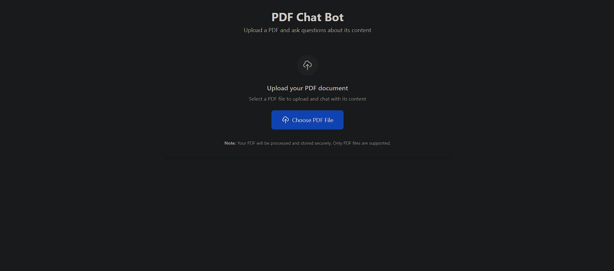

RAG BASED PDF Chat Bot
**Backend** : Node.js ,Express.js ,LangChain , Google Gemini AI, Multer
**Frontend** : React.js ,TailwindCSS ,Axios 
**Database** : QdrantDB - Vector database running in Docker

1. Clone and Install
npm install
npm run install-all

2. Environment Setup
Create environment files for both frontend and backend:
backend
GEMINI_API_KEY=your_gemini_api_key_here
QDRANT_URL=http://localhost:6333
PORT=5000

frontend
REACT_APP_API_URL=http://localhost:5000

3. Start QdrantDB (Vector Database)
docker-compose up -d
This will start QdrantDB on port 6333. You can verify it's running by visiting http://localhost:6333/dashboard

4. Run the Application
npm run dev

5. Use the Application

1. Open your browser and go to http://localhost:3000
2. Upload a PDF file using file picker
3. Wait for processing (you'll see a success message)
4. Start asking questions about your PDF content

SAMPLE USAGE
PDF Chat Bot Interface

